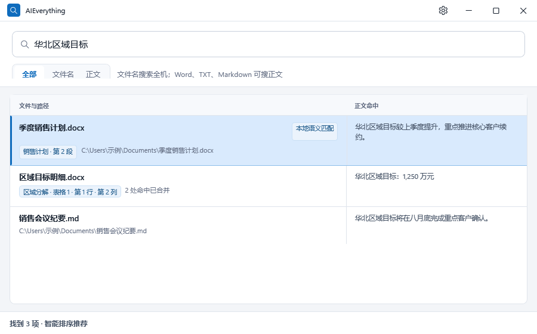

# AIEverything

轻量、本地优先的 Windows 文件搜索工具。

> 以 Everything 作为快速的全盘文件名搜索引擎，再增加正文索引、结果净化和智能排序。

适合需要在 Windows 全机快速查找文件名，并按内容定位 Word、TXT、Markdown 原文的办公用户。



AIEverything 是独立开源项目，不是 voidtools 官方产品，也不隶属于 voidtools。文件名能力基于随包分发的 Everything 1.4 引擎和 SDK；相关版权与许可证归原作者所有。

## 三个核心特点

### 1. 像 Everything 一样快速找名字

打开即可按文件名和路径搜索本机文件、文件夹。AIEverything 使用 Everything 已维护的 NTFS/ReFS 元数据索引，不用自己递归遍历整台电脑。

### 2. 不只知道文件名，还能找到正文位置

可选的本地正文索引覆盖固定磁盘中的 `.txt`、`.md`、`.markdown`、`.docx`。TXT 命中返回行号，Markdown 命中返回标题路径和行号；Word 命中显示标题路径、段落或表格坐标。同一文件的多处命中合并成一条结果，可直接预览、打开、定位或复制引用。

### 3. 结果更少干扰，更接近用户真正想找的内容

高置信度的临时文件和一次性产物不会占据结果列表；系统、依赖、缓存和构建内容降级展示，精确搜索仍可找回。桌面端还会结合本机使用行为和本地 MiniLM 语义重排优化前五项，而不改变原始候选集合。

## 快速开始

直接下载 [AIEverything-1.0.1-win-x64.zip](https://github.com/stableye/AIEverything/releases/download/v1.0.1/AIEverything-1.0.1-win-x64.zip)，解压到普通可写目录后双击 `AIEverything.exe`。无需安装 .NET SDK。

三步开始使用：

1. 下载并解压便携 ZIP。
2. 双击 `AIEverything.exe`，文件名搜索立即可用。
3. 点击“启用正文”，后台逐步加入 Word、TXT 和 Markdown 正文；搜索期间界面仍可使用。

校验文件：[SHA-256](https://github.com/stableye/AIEverything/releases/download/v1.0.1/AIEverything-1.0.1-win-x64.zip.sha256)。遇到问题请[直接反馈](https://github.com/stableye/AIEverything/issues/new)。源码构建：

```powershell
git clone https://github.com/stableye/AIEverything.git
cd AIEverything
powershell -NoProfile -ExecutionPolicy Bypass -File scripts\fetch-model.ps1
powershell -NoProfile -ExecutionPolicy Bypass -File scripts\build-standalone.ps1
```

构建完成后，解压 `dist\AIEverything-1.0.1-win-x64.zip` 到普通可写目录，双击 `AIEverything.exe`。文件名搜索立即可用；如需正文搜索，在首次提示或设置中启用正文索引。

首次运行可能需要 Windows 授权启动 Everything 本机索引服务。正文索引在后台逐步建立，不阻塞文件名搜索。完整环境、验证和打包说明见 [docs/BUILDING.md](docs/BUILDING.md)。

## 工作原理

```text
搜索词
  ├─ 文件名/路径 ── Everything SDK ── 噪音分层 ───────┐
  └─ 正文 ── 本地 SQLite FTS5 ── 命中位置与片段 ──────┤
                                                       ├─ 合并结果
用户操作历史 ── 加盐聚合 ──────────────────────────────┤
本地 MiniLM ── 仅重排前 10 个候选 ────────────────────┤
可选 DeepSeek ── 仅在低置信歧义时重排已有候选 ────────┘
```

- Everything 负责快速召回全机文件名和路径。
- 后台服务通过 Everything 分页发现正文候选，不递归爬全盘。
- 中文使用相邻双字、英文按单词写入本机 SQLite FTS5 倒排索引。
- `全部` 模式合并文件名与正文证据；同一文件只显示一条。
- 排序遵守 `精确命中 > 普通候选 > 低价值候选`，AI 只能重排已有候选，不能新增、删除或绕过过滤规则。

组件和数据流详见 [docs/ARCHITECTURE.md](docs/ARCHITECTURE.md)。

## 当前支持范围

| 能力 | 1.0.1 |
|---|---|
| 文件名和路径 | Everything 能发现的本机文件与文件夹 |
| 正文格式 | `.txt`、`.md`、`.markdown`、`.docx` |
| 正文磁盘 | 已就绪的本地固定 NTFS/ReFS 磁盘 |
| 正文定位 | TXT 行号；Markdown 标题路径和行号；Word 标题路径、段落或表格坐标 |
| 结果操作 | 只读预览、打开、资源管理器定位、复制引用 |
| 本地排序 | 行为偏好 + 内置 MiniLM Top10 重排 |
| 云端排序 | DeepSeek 歧义增强，默认启用、无凭据时自动回退本地 |

正文索引默认排除 Windows、Program Files、ProgramData、AppData、临时/缓存/依赖/构建目录、其他用户目录、危险文件属性和整个代码仓库子树。这些限制不影响按文件名查找相应文件。

## 隐私

- 文件名搜索、正文索引和本地智能排序均可离线运行。
- 提取后的正文保存在 `%LOCALAPPDATA%\AIEverything\content.db`，行为聚合保存在 `ranking.db`；两者位于本机且未单独加密。
- 行为库不保存原始查询、明文路径或正文，只保存随机盐加盐后的文件/目录键、扩展名和每日聚合。
- DeepSeek 默认启用。只有 Windows 凭据管理器中已配置凭据，且本地模型确认查询存在歧义时才可能调用；无凭据或调用失败时静默使用本地排序。
- 软件不会修改、移动或删除用户源文件。

完整数据边界见 [PRIVACY.md](PRIVACY.md)，安全问题请参阅 [SECURITY.md](SECURITY.md)。

## 已知限制

- 目前只支持 Windows x64。
- TXT/Markdown 仅支持 UTF-8、UTF-8 BOM、带 BOM 的 UTF-16 LE/BE，最大 5 MiB；DOCX 最大 10 MiB；每个文件最多索引 1,000,000 个字符，最长处理 15 秒。
- PDF、旧版 DOC、RST、XLSX、PPTX、OCR、邮件和聊天内容不在 1.0.1 正文索引范围。
- Word 暂不索引页眉页脚、批注、修订、脚注、文本框或嵌入对象；不承诺页码或自动跳转到 Word 内命中位置。
- 首次建立全机正文索引时可能产生较高 CPU 和磁盘活动。
- 本地语义模型需要 x64 AVX2；模型缺失、硬件不支持或推理失败时会安全回退到确定性/行为排序。
- 文件名结果补充和重排最多检查前 500 个 Everything 候选，不等价于展示所有匹配项。

## 可选 Agent 接口

仓库保留只读 MCP/Skill 适配器，供 Agent 搜索文件名以及已经由桌面端建立的 Word/TXT/Markdown 正文索引。它不是桌面应用的运行前提，也不随默认桌面包安装。

```powershell
powershell -NoProfile -ExecutionPolicy Bypass -File scripts\build-agent-connector.ps1
```

## 参与贡献

欢迎提交问题和 Pull Request。开始前请阅读 [CONTRIBUTING.md](CONTRIBUTING.md)，了解当前产品边界、构建命令和最小验证要求。开源发布前的维护者清单见 [OPEN_SOURCE_CHECKLIST.md](OPEN_SOURCE_CHECKLIST.md)。

## 许可证

AIEverything 源码使用 [MIT License](LICENSE)。Everything、ONNX Runtime、Tokenizer、本地模型及其他依赖分别遵循其原许可证，详见 [THIRD_PARTY_NOTICES.md](THIRD_PARTY_NOTICES.md)。
